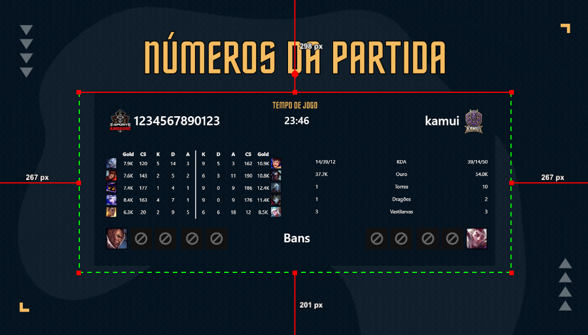
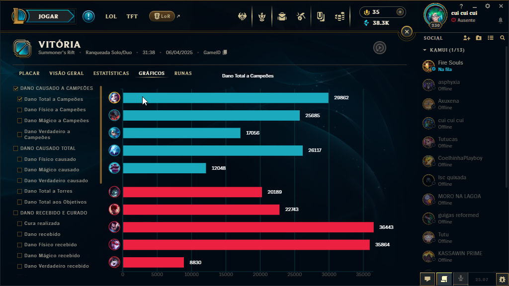

# SIMPLE POST GAME USING LEAGUE BROADCAST WEBSOCKET!

This is a React application that integrates with League Broadcast to display custom overlays during champ select and in-game.

## showcase

This application shows a post game informations for you using in your broadcast transmission.



## Manual Input: Total Damage Dealt per Player

> ⚠️ **Warning**: This feature is **manual** and works as a **temporary workaround**. There is no automatic integration with the Riot API or League Broadcast for damage data.

To display the **total damage dealt per player**, you must manually input the values in the following file:

> public/data/total-damage.json

### Example format:

``` json  
{
  "teams": [
    {
      "players": [
        25685,
        15231,
        8021,
        45123,
        14235
      ]
    },
    {
      "players": [
        33123,
        10000,
        63121,
        56123,
        4234
      ]
    }
  ]
}
```

### Position Reference:

- `teams[0]` = **Blue Side**
- `teams[1]` = **Red Side**
- `players[0]` = **Top**
- `players[1]` = **Jungle**
- `players[2]` = **Mid**
- `players[3]` = **ADC**
- `players[4]` = **Support**

### How to input the data:

1. Open the **League of Legends client** and go to your **Match History**.
2. Select the match you want and navigate to the **Graphs** tab.
3. Look at the **Damage Dealt to Champions** chart.
4. Manually copy the damage values shown for each player.
5. Insert those values in the correct order and positions inside the `total-damage.json` file.



> 💡 This is a manual process and only intended as a temporary workaround until full automation becomes possible.

Claro! Aqui está a seção complementar em inglês, explicando que os outros dados (KDA, gold, torres etc.) são automáticos e extraídos via WebSocket do League Broadcast:

---

## Automatic Data: KDA, Gold, Objectives, and Bans

Good news! Most of the in-game and post-game stats are handled **automatically** by the system. The app connects to **League Broadcast via WebSocket** to retrieve real-time and post-game data and display it on screen without any manual input.

The following data is **automatically collected and displayed**:

- **KDA** (Kills / Deaths / Assists)
- **Gold earned**
- **Towers destroyed**
- **Drakes taken**
- **Epic monsters (Grubs, Baron and Atakhan)**
- **Champion bans (during champ select)**

> ✅ As long as League Broadcast is running and configured properly, this information will be fetched and updated in real time with no action required from the user.
## todo
- [ x ] Made a prototype application.
- [ x ] Apply the project pattern on the code.
- [   ] Get more usefull information.

## Prerequisites

- Node.js installed (version 16 or higher)
- NPM or Yarn installed
- League Broadcast installed and configured

## How to Run the Project

1. **Open League Broadcast**
   - Make sure League Broadcast is installed and running correctly.

2. **Enable Champ Select and In-Game**
   - In League Broadcast, enable the `Champ Select` and `In-Game` options so the app can capture the necessary data.

3. **Disable Mock for Both Overlays**
   - In League Broadcast, disable the `Mock` option for both overlays (`Champ Select` and `In-Game`) to ensure the app receives real game data.

4. **Start the React App**
   - Navigate to the React project directory in your terminal and run the following command to start the development server:

```bash
npm run dev
```

   - Or, if you're using Yarn:

```bash
yarn dev
```


## Accessing the Application

To use the application properly, you **must provide the WebSocket (WS) address** of League Broadcast in the URL.

### Example:

> http://localhost:5173/?ws=localhost:58869

- Replace `58869` with the actual port your **League Broadcast WebSocket** is using (default is usually 58869).
- This allows the app to connect to League Broadcast and start receiving real-time game data automatically.

> ⚠️ If you don't include the `?ws=` parameter, the app open this default url for league broadcast `localhost:58869` 

## Project Structure

- `src/`: Contains the React application source code.
- `public/`: Contains static files like `index.html`.
- `package.json`: Contains project dependencies and scripts.

## Dependencies

Make sure all project dependencies are installed. To install the dependencies, run:

```bash
npm install
```

or

```bash
yarn install
```

## Contributing

If you'd like to contribute to this project, feel free to open an issue or submit a pull request.

## License

This project is licensed under the [MIT License](LICENSE).

