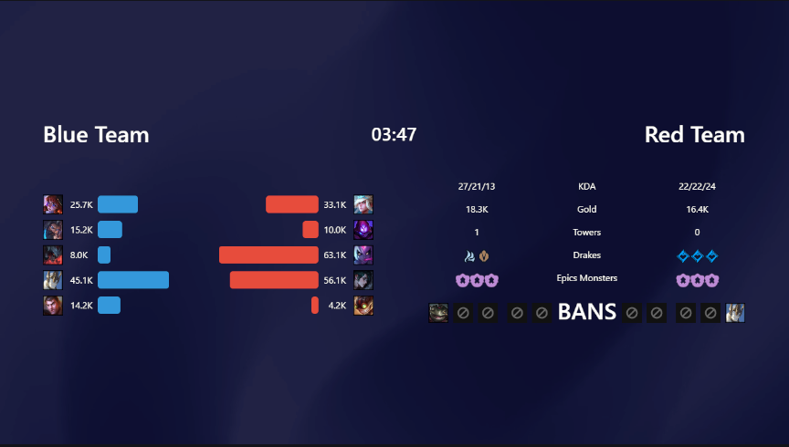
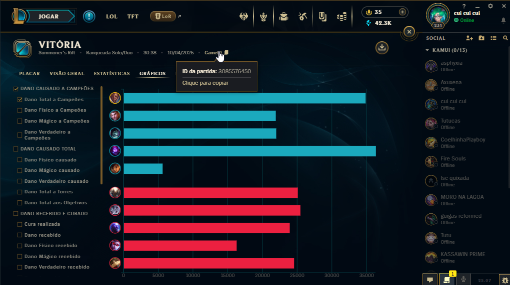

# SIMPLE POST GAME USING LEAGUE BROADCAST WEBSOCKET AND LEAGUE CLIENT DATA

This is a React application that integrates with League Broadcast to display custom overlays during champ select and in-game.

## Showcase

This application shows post-game information for use in your broadcast transmission.




## How It Works: Total Damage Dealt per Player

>
> ⚠️ **Warning**: This feature now allows you to automatically retrieve the total damage dealt per player based on the `gameId` provided in the file `match-id.json`.
>

### Steps to Set Up Automatic Damage Data:

1. **Provide the `gameId`**:  
   You only need to provide the `gameId` in the file `public/data/match-id.json`. This is the ID of the match you want to fetch data for.
   Example format for `match-id.json`:
   ```json 
   {
      "id": "3085603741"
    }
    ```

2. **Automatic Data Retrieval**:  
   Once you have the `gameId` in `match-id.json`, the app will automatically retrieve the **total damage dealt per player** from the League Client, only need to set gameId.

   

### Position Reference:

> - `teams[0]` = **Blue Side**
> - `teams[1]` = **Red Side**
> - `players[0]` = **Top**
> - `players[1]` = **Jungle**
> - `players[2]` = **Mid**
> - `players[3]` = **ADC**
> - `players[4]` = **Support**

## Automatic Data: KDA, Gold, Objectives, and Bans

Good news! Most of the in-game and post-game stats are handled **automatically** by the system. The app connects to **League Broadcast via WebSocket** to retrieve real-time and post-game data and display it on screen without any manual input.

The following data is **automatically collected and displayed**:

> - **KDA** (Kills / Deaths / Assists)
> - **Gold earned**
> - **Towers destroyed**
> - **Drakes taken**
> - **Epic monsters (Grubs, Baron and Atakhan)**
> - **Champion bans (during champ select)**
>
> ✅ As long as League Broadcast is running and configured properly, this information will be fetched and updated in real time with no action required from the user.

## TODO

> - [x] Made a prototype application.
> - [x] Apply the project pattern on the code.
> - [ ] Get more useful information.

## Prerequisites

> - Node.js installed (version 16 or higher)
> - NPM or Yarn installed
> - League Broadcast installed and configured
> - **League of Legends Client Path** (see below)

## Configuration: `config.json`

Before running the backend, you need to specify the path where your **League of Legends client** is located.

Create or update the file `backend/config.json` with the following content:

```json
 {
     "client_path": "C:\\Riot Games\\League of Legends"
 }
```

 Replace `"C:\\Riot Games\\League of Legends"` with the correct path where the League of Legends client is installed on your system.

## How to Run the Project


### 1. Install Dependencies (Frontend and Backend)

Make sure all project dependencies are installed in both the frontend and backend by running the following commands in both directories:

- **In the frontend directory**: `npm install` or `yarn install`


- **In the backend directory**: `npm install` or `yarn install`

### 2. Build the Frontend

Once the dependencies are installed, build the frontend React app by running: `npm run build`

This will create a production-ready build of the React app inside the `frontend/dist` directory.

### 3. Start the Backend

Once the frontend build is ready, start the backend by running: `node index.js`

Ensure that the `client_path` is correctly set in `backend/config.json` before starting the backend.

## Accessing the Application

To use the application properly, you **must provide the WebSocket (WS) address** of League Broadcast in the URL.


> example: http://localhost:9721/?ws=localhost:58869
>
> Replace `58869` with the actual port your **League Broadcast WebSocket** is using (default is usually 58869).
> This allows the app to connect to League Broadcast and start receiving real-time game data automatically.
>
>⚠️ If you don't include the `?ws=` parameter, the app will open this default URL for League Broadcast `localhost:58869`.

## Project Structure

> - `src/`: Contains the React application source code.
> - `public/`: Contains static files like `index.html`.
> - `package.json`: Contains project dependencies and scripts.

## Contributing

If you'd like to contribute to this project, feel free to open an issue or submit a pull request.

## License

This project is licensed under the [MIT License](LICENSE).
